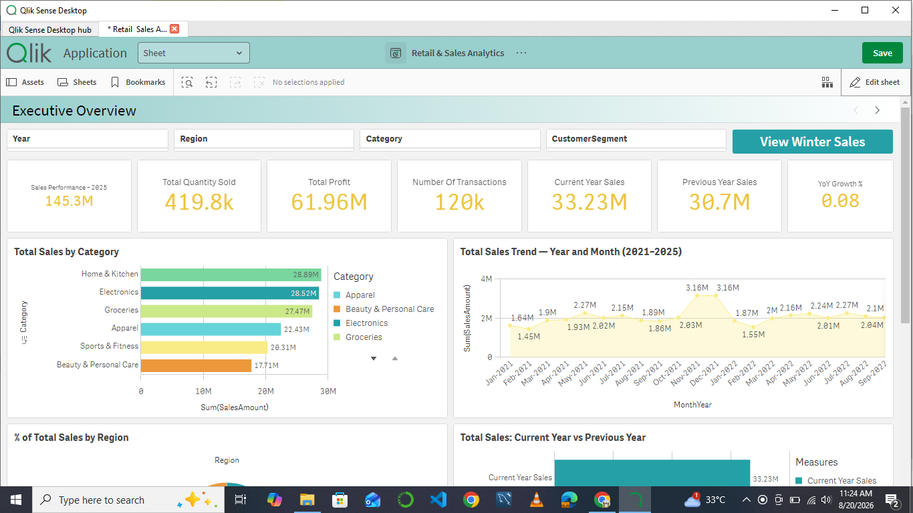
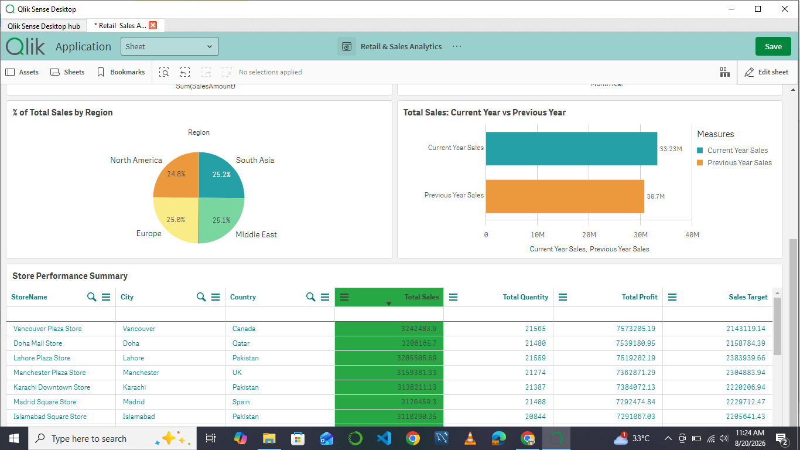
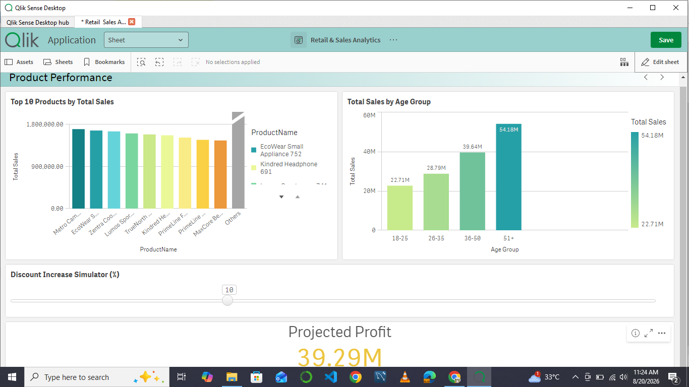
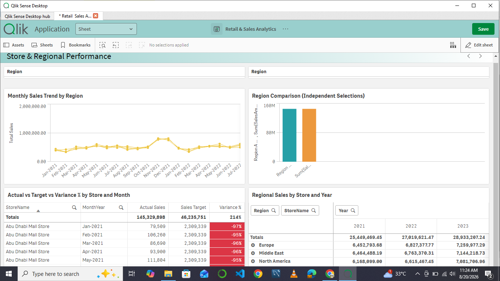
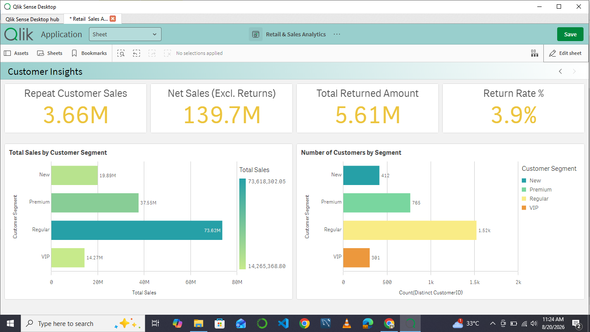

# Retail & Sales Analytics

A multi-table Qlik Sense data model and dashboard built as part of a Qlik Sense internship assignment, covering data loading, data modeling, set analysis, master items, and advanced techniques across 7 related retail datasets.

## Dataset

7 CSV tables covering a 5-year retail sales history (2021–2025):

| Table | Description | Rows |
|---|---|---|
| SalesTransactions | Fact table: one row per sales transaction line | 120,000 |
| Products | Product master data: category, sub-category, brand, pricing | 228 |
| Stores | Store master data: city, country, region, store type | 20 |
| Employees | Employee master data, linked to stores | 113 |
| Customers | Customer master data: demographics, segment, loyalty | 3,000 |
| Calendar | Date dimension: year, quarter, month, week, weekend/holiday flags | 1,826 |
| SalesTargets | Monthly sales target per store | 1,200 |

## Data Model

Built as a clean star schema in the Data Load Editor, with `SalesTransactions` as the central fact table associated to `Stores`, `Products`, `Customers`, `Employees`, and `Calendar`.

Key modeling decisions:
- **Synthetic keys resolved**: the raw data initially produced 3 unintended synthetic keys (accidental field-name collisions between `Employees`/`SalesTransactions` on `StoreID`+`EmployeeID`, and `Stores`/`Customers` on `City`+`Country`), fixed by renaming ambiguous fields with `AS` aliases.
- **Composite key handling**: `SalesTargets` (grain: StoreID + Year + Month) doesn't share a single natural key with the fact table. Resolved using a `Mapping LOAD` + `ApplyMap()` to attach each transaction's correct monthly target directly onto `SalesTransactions` at script load time, avoiding synthetic keys and circular references.
- **Data validation**: several relationships were empirically verified against the raw data before being relied on (e.g., confirming `SalesTransactions.StoreID` matches `Employees.StoreID` with zero mismatches across all 120,000 rows).

## Dashboard Structure

### Executive Overview
Company-wide KPIs (Total Sales, Profit, Transactions, YoY Growth), sales trend, category and regional breakdowns, store performance table, and a bookmark shortcut.

### Product Performance
Top products by sales, sales by customer age group, and an interactive discount-increase simulator projecting profit impact.

### Store & Regional Performance
Regional sales pivoted by store and year, monthly trend by region (small multiples), actual vs. target vs. variance analysis with conditional formatting, and an independent-selection region comparison.

### Customer Insights
Repeat customer sales (advanced set analysis using nested aggregation), net sales excluding returns, return rate, and sales/customer counts by segment.

## Techniques Used

- Set analysis (year-over-year comparisons, exclusion filters, nested aggregation for repeat-customer analysis)
- Master measures and master dimensions, including drill-down hierarchies
- Variables used both in expressions and dynamically in object titles
- Pivot tables with subtotals
- Alternate states for independent side-by-side comparison
- Bookmarks with button-triggered application
- Trellis (small multiples) charts
- Conditional formatting (red/green actual-vs-target coloring)
- Calculated dimensions (customer age bucketing)
- What-if analysis via a variable-driven input slider
- Incremental load strategy (documented conceptually via QVD-based script comments)
- Performance optimization (removal of unused/redundant fields)

## Notes

- Section Access (row-level security) was scoped out of this build; the reduction logic was reviewed but not implemented, since it required no real manager login accounts to test against meaningfully.
- The incremental load task is documented as a commented script block rather than run live, since the source data is a single static CSV snapshot with no separate "new records" feed to test against.

## How to open

Open `Retail & Sales Analytics.qvf` in Qlik Sense Desktop, or upload it to a Qlik Sense Cloud/Enterprise environment.
